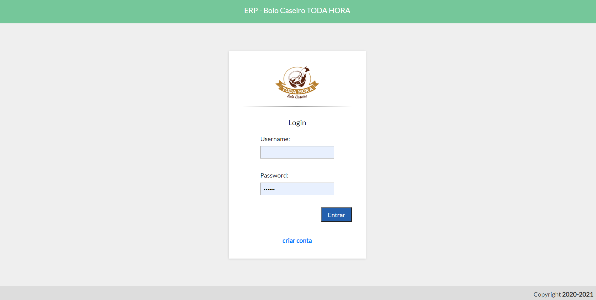
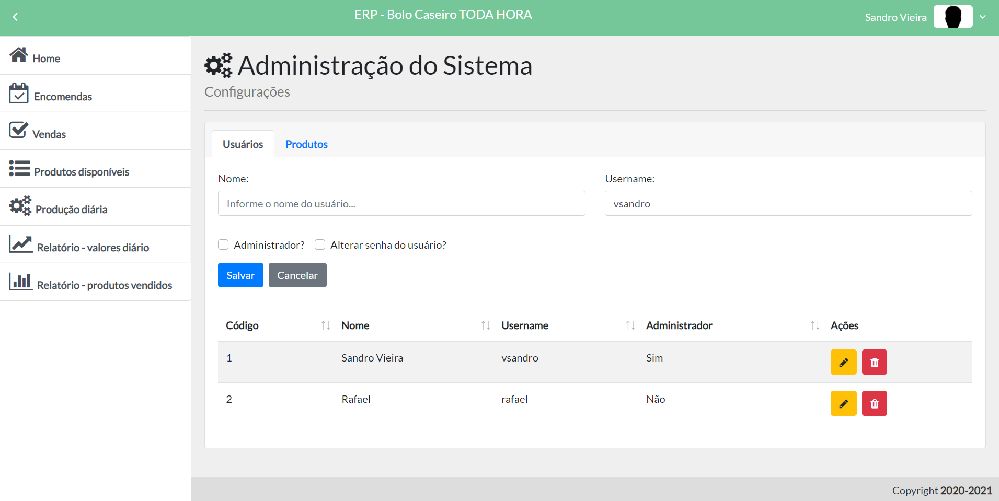
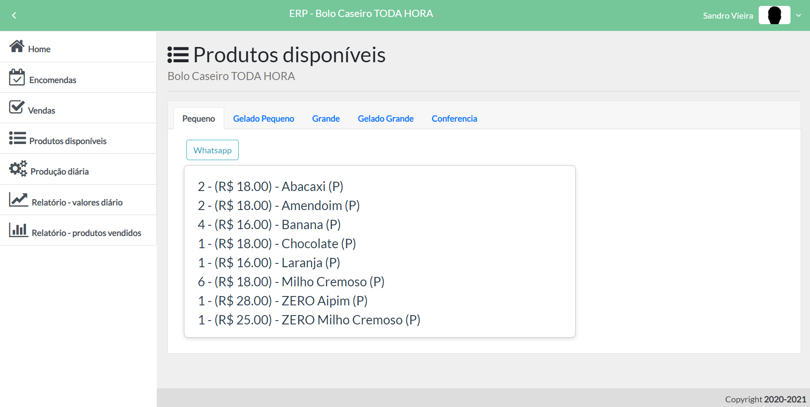

# APP-BCTH-ERP
Sistema desenvolvido em **Vue.js** para empresa Bolo Caseiro TODA HORA

<p align='center'>
 
</p>


## 1. Introdução

Aplicação desenvolvida em **Vue.js** para **Bolo Caseiro TODA HORA** no ano de 2020.

<p align='center'>
 
</p>

## 2. Definições

### Bolo Caseiro TODA HORA

Empresa do segmento de alimentação que produz e comercializa bolos caseiros na cidade de Nilópolis - RJ


## 3. Tecnologias (Techs)

- NodeJs
- Vue.js
- Bootstrap
- ValidatingToken
- Banco de dados Postgres
- Knex migrations
- Web Token (JWT)


## 4. Funcionalidades

- CRUD produtos;
- gerar produção de bolos;
- realizar vendas;
- agendar encomenda;
- relatório com os totais de valores devendidos no período;
- relatório com os totais produtos vendidos no período.

<p align='center'>
 
 

</p>


## 5. Instalação e execução. :octocat:

- [Clone](https://help.github.com/articles/cloning-a-repository/) o projeto na sua máquina executando o seguinte comando no seu terminal:

```sh
git clone https://github.com/vsandro/APP-BCTH-ERP.git
```

**Mongodb**

- Execute o Mongo com o comando:

```sh
mongod
```

**Backend**

- Instale as dependências do projeto com o comando:

```sh
cd backend
npm i
```

- Rode o backend do projeto na sua máquina com:

```sh
npm start
```

**Frontend**

- Instale as dependências do projeto com o comando:

```sh
cd frontend
npm i
```

- Rode o backend do projeto na sua máquina com:

```sh
npm run serve -- --port 8081
http://localhost:8081
```

## 6. Autoria

Este projeto foi desenvolvido por [Sandro Vieira](https://www.linkedin.com/in/vsandro) conforme levantamento de requisitos realizado com o cliente.


